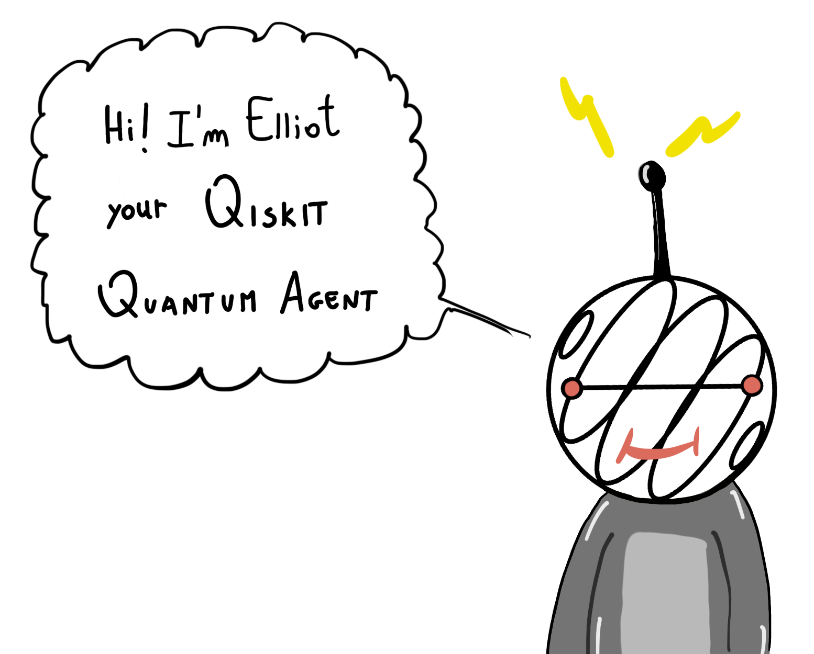

# Quantum Reinforcement Learning (Qiskit Hackathon Europe)



> This reposiotry contains the materials developed for IBM's Qiskit Europe Hackathon. More information about the event here: https://qiskithackathoneurope.bemyapp.com/#/event

For the Hackathon, our team decided to focus on Quantum Reinforcement Learning [[1](#1), [2](#2), [3](#3)], a super interesting field of research which tries to bring together Classical Reinforcement Learning and Quantum Computing.  

## Motivation  
Reinforcement Learning (RL) [[1]](#1) is a machine learning paradigm dealing with autonomous intelligent agents, which learn wihtout supervision by direct interaction with an external environment. These agents are *rewarded* for performing *good actions*, and their goal is to find an optimal *policy* (behaviour) to maximize these rewards, thus *solving* the envirnoment (i.e. a task). As the field of artificial intelligence advances, the demand for algorithms that can learn quickly and efficiently increases, and speed-ups are more welcome than ever. Driven by the promising idea of a *quantum speed-up*, the development of Quantum Reinforcement Learning (QRL) algorithms has begun in the last few years [[1](#1), [2](#2), [3](#3)].  
The main idea of our project is to create and train a +Quantum Agent*, from now on named **Elliot**, developed with entirely with Qiskit, capable of using quantum computing to speed up its own learning process and possibly outperform its classical counterpart [[4]](#4).  
Since it's a very new field, the first questions we addressed are the fundamentals: how can we translate the building blocks of Classical RL efficiently in a Quantum setting? How do quantum agents perceive? What does it mean to take a quantum action? Last, but not least, the most important questions: how does our quantum agent perform in a fully quantum environment? Can it learn to play quantum games better than a classical agent and human minds? 

## Outline of the project

The project is divided in two main phases: the first was to give birth to Elliot, i.e. a RL algorithm that uses quantum computation as an internal resource, and train it on *classical environments*. In the second phase we let Elliot interface with a quantum game (Quantum TicTacToe). As for the first phase, we all collaborated to the algorithm design and theory, although Paolo is the major contributor of the Grover-like algorithm while Stefano is the major contributor to the Parametric Quantum Circuit (PQC) code. In the second phase, again we all collaborated to the theory discussion, while Jani wrote the code for the Quantum environment we train Elliot against.  

More in detail, in this repository you find three main codes:

1. **Grover-like amplitude enhancing** 
We implemented Quantum Reinforcement Learning à la Grover [[2]](#2), where a Grover-like procedure is used to amplify the amplitudes corresponding to *good actions*. We tested this approach against the `FrozenLake` environment, provided by OpenAI `gym`. 

2. **Quantum Approximate Q-learning with Parametric Quantum Circuits**
Quantum Reinforcement Learning with a *Variational* approach**. In particular, we implemented the architecture proposed in [[3]](#3), which leverages a Quantum Neural Network (i.e. a parametrized quantum circuit) in the framework of Approximate Q-Learning and Deep Q-Learning [[5]](#5). We tested this approach against the `CartPole` environment, again provided by OpenAI `gym`.

3. **A Quantum Agent in a Quantum World**
Implementation of a fully quantum model, where Elliot, the quantum agent, tries to learn how to play *Quantum TicTacToe*. We used the Grover approach to train the agent, and we built a custom Qiskit implementation of a Quantum TicTacToe environment.

For more details and results, see the accompanying final report **Aggiungere nome del report**, or the brief video presentation.

## File organization

Each of the three steps described above is contained inside the corresponding folder. Note that implementation **1** and **3** come with of python scripts, while implementation **2** consists of Jupyter Notebooks.

## Requirements 

In order to run the code, the following packages are needed: 

* `Qiskit` (for installation see: https://qiskit.org/documentation/getting_started.html)
* `Qiskit Machine Learning` (for installation see: https://github.com/Qiskit/qiskit-machine-learning#installation)
* `PyTorch` (can install throug qiskit-machine-learning, or see https://pytorch.org/get-started/locally/ )
* `gym` (for installation see: https://gym.openai.com/docs/)
* `numpy`, `matplotlib` (optional, `seaborn`)
* **che altro**?

You may want to create a virtual environment (using `conda` for example) before installing the packages.

```
pip install qiskit
pip install 'qiskit-machine-learning[torch]' # includes PyTorch
pip install gym
pip install numpy
pip install matplotlib
```

---

## Selected publications

<a id="1">[1]</a> [Reinforcement Learning](https://en.wikipedia.org/wiki/Reinforcement_learning), Wikipedia. 

<a id="2">[2]</a> _Quantum Reinforcement Learning_ (2018, Dong et al.). [Published article](https://ieeexplore.ieee.org/document/4579244/),  [arXiv:0810.3828](https://arxiv.org/abs/0810.3828)

<a id="3">[3]</a>  _Quantum agents in the Gym: a variational quantum algorithm for deep Q-learning_ (2021, Skolik et al.). [arXiv:2103.15084](https://arxiv.org/abs/2103.15084)

<a id="4">[4]</a> _Experimental quantum speed-up in reinforcement learning agents_ (2021, Saggio et al.). [Published article](https://www.nature.com/articles/s41586-021-03242-7)

<a id="5">[5]</a> [Q-learning](https://en.wikipedia.org/wiki/Q-learning), Wikipedia.